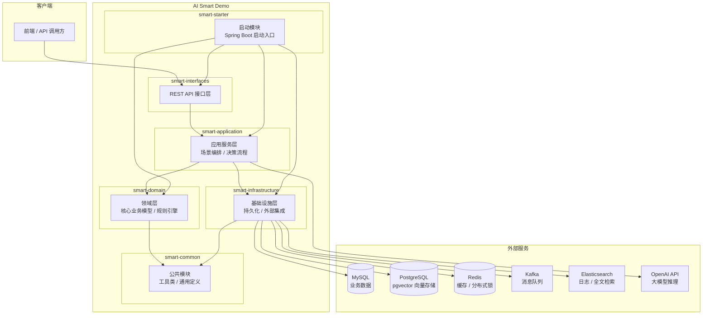

# AI Smart Demo

基于 DDD（领域驱动设计）架构的智慧能源管理系统演示项目。集成规则引擎、RAG 知识检索与 AI 大模型推理，实现光储电站的智能决策与自动化控制。

## 系统架构



## 技术栈

| 类别 | 技术 |
|------|------|
| 语言 & 框架 | Java 17, Spring Boot 3.x, Spring AI |
| 架构模式 | DDD 六边形架构 |
| 关系数据库 | MySQL 8.0 |
| 向量数据库 | PostgreSQL 16 + pgvector |
| 缓存 | Redis 7 |
| 消息队列 | Apache Kafka |
| 搜索引擎 | Elasticsearch 8 |
| AI 大模型 | OpenAI GPT（兼容接口） |
| 构建工具 | Maven 3.9+ |
| 容器化 | Docker, Docker Compose |

## 模块说明

| 模块 | 说明 |
|------|------|
| `smart-starter` | Spring Boot 启动入口，负责组装所有模块并启动应用 |
| `smart-interfaces` | 接口层，定义 REST API、DTO 对象和参数校验 |
| `smart-application` | 应用层，编排领域服务，实现业务用例（场景决策、知识检索等） |
| `smart-domain` | 领域层，包含核心业务模型、领域服务、规则引擎和仓储接口 |
| `smart-infrastructure` | 基础设施层，实现持久化、外部 API 调用、消息发送等 |
| `smart-common` | 公共模块，提供工具类、常量定义、通用异常等 |

## 快速开始

### 环境要求

- JDK 17+
- Maven 3.9+
- Docker & Docker Compose

### 1. 启动基础设施

```bash
# 复制环境变量配置
cp .env.example .env

# 启动所有依赖服务（MySQL、PostgreSQL、Redis、Kafka、Elasticsearch）
docker-compose up -d
```

### 2. 编译项目

```bash
# 使用 Maven 编译
mvn clean install -DskipTests

# 或使用 Make
make build
```

### 3. 运行应用

```bash
# 使用 Maven 启动
mvn -pl smart-starter spring-boot:run

# 或使用 Make
make run
```

### 4. 访问服务

应用启动后，访问以下地址：

- 应用地址: `http://localhost:8080`
- Swagger UI: `http://localhost:8080/swagger-ui.html`

## 常用命令

```bash
make build    # 编译（跳过测试）
make test     # 运行测试
make pmd      # PMD 代码检查
make clean    # 清理构建产物
make all      # 完整构建（编译 + PMD + 测试）
```

## API 文档

项目集成了 Swagger/OpenAPI，启动应用后访问：

- Swagger UI: [http://localhost:8080/swagger-ui.html](http://localhost:8080/swagger-ui.html)
- OpenAPI JSON: [http://localhost:8080/v3/api-docs](http://localhost:8080/v3/api-docs)

## 数据库初始化

SQL 初始化脚本位于 `deploy/sql/` 目录：

- `mysql-init.sql` — MySQL 业务表（电站、设备、场景、规则、数据采集、决策记录等）
- `postgres-init.sql` — PostgreSQL 向量表（知识分片 + pgvector 索引）

使用 Docker Compose 启动时，初始化脚本会自动执行。
